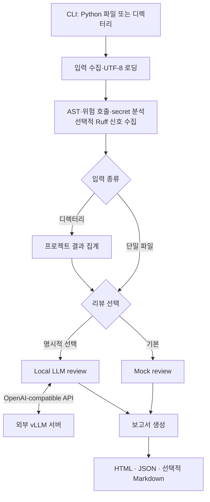

# Project NuriLab

Project NuriLab은 로컬 환경에서 Python 소스의 정적 보안 신호를 수집하고, 이를
사람이 검토할 수 있는 보고서로 정리하는 도구입니다. 단일 `.py` 파일 또는 Python
프로젝트 디렉터리를 입력하면 AST 구조, 위험 호출 후보, hard-coded secret 후보와
선택적 Ruff 결과를 수집해 HTML 및 JSON 보고서를 만듭니다.

이 프로젝트가 지향하는 장기 방향은 폐쇄적 환경에서도 사용할 수 있는
의심 파일·소스 분석 보조 시스템입니다. 다만 현재 제품 계약은 **Python 정적 분석과
선택적 Local LLM review**입니다. 코드의 악성 여부를 확정하거나 입력을 실행하지
않습니다.

## 배경과 원칙

반복적인 코드 리뷰와 보안 분석은 분석 대상과 재검토 횟수가 늘수록 비용과 운영
복잡도가 커집니다. NuriLab은 재현 가능한 정적 신호를 먼저 만들고, 필요할 때만
로컬에서 이미 실행 중인 LLM에 그 신호의 요약·해석을 요청하는 경계를 선택했습니다.

- **deterministic analyzer가 판단 근거입니다.** LLM은 결과를 요약하고 우선순위를
  정하며 권고안을 작성하지만, 정적 분석 결과를 덮어쓰지 않습니다.
- **기본 실행은 오프라인 Mock review입니다.** Local LLM은 사용자가
  `--review-client local`을 명시했을 때만 호출합니다.
- **실패도 결과로 남깁니다.** 파일 로드, 문법, Ruff, Local LLM 문제 중 계속할 수
  있는 것은 report finding 또는 skipped 결과로 보존합니다.
- **보고서는 같은 분석 결과에서 만듭니다.** JSON은 기계가 읽는 canonical artifact,
  HTML은 기본 사람이 읽는 view이며 Markdown은 선택 출력입니다.

## 현재 구조



단일 파일은 분석 결과를 곧바로 review로 전달합니다. 디렉터리 입력은 파일별 분석을
`ResultAggregator`가 프로젝트 요약으로 집계한 뒤 review합니다. 모듈별 책임과
데이터 계약, 실패 경계는 [아키텍처 문서](docs/ARCHITECTURE.md)에 설명합니다.

```text
project_nurilab/
├── input/          # 입력 수집과 UTF-8 로딩
├── analyzers/      # AST, 위험 호출, secret, Ruff 신호
├── aggregation/    # 프로젝트 summary와 risk 집계
├── llm/            # Mock / Local review client
├── reports/        # HTML, JSON, Markdown 렌더링
├── schemas.py      # 단계 사이 데이터 계약
├── pipeline.py     # 분석 흐름 조정
├── cli.py          # CLI option과 backend 선택
└── config.py       # 기본값과 제외 경로
```

| 영역 | 책임 |
| --- | --- |
| 입력·정적 분석 | Python 소스 수집과 재현 가능한 위험 신호 생성 |
| 집계 | 파일별 결과를 프로젝트 요약으로 결합 |
| 리뷰 | Mock 또는 외부 Local LLM으로 신호를 해석 |
| 보고서 | 같은 결과를 HTML/JSON/선택적 Markdown으로 표현 |

저장소의 `tests/`는 회귀 검증, `docs/`는 운영·설계 문서,
`references/`는 출처와 상태를 표시한 참고 자료를 담습니다.

## 빠른 시작

요구 환경은 Python 3.12와 [uv](https://docs.astral.sh/uv/)입니다.

```bash
uv sync --locked
uv run python main.py analyze tests/fixtures/vulnerable_sample.py
```

프로젝트 디렉터리도 같은 명령으로 분석합니다.

```bash
uv run python main.py analyze tests
```

기본 결과는 `reports/`에 생성됩니다.

```text
reports/
├── vulnerable_sample.analysis.html
└── vulnerable_sample.analysis.json
```

CLI 전체 option, 출력 형식, 환경변수와 Local LLM 설정은
[사용 안내](docs/USAGE.md)를 참조하세요.

## 보고서 예시

무해한 fixture `tests/fixtures/vulnerable_sample.py`를 Mock review와
`--no-ruff`로 분석하면 10줄 파일에서 다음 신호를 확인할 수 있습니다.

```bash
uv run python main.py analyze tests/fixtures/vulnerable_sample.py --review-client mock --no-ruff
```

```text
review.risk_level: high
analysis.suspicious_calls:
  - os.system, line 9, high
  - subprocess.run, line 10, medium
analysis.secrets:
  - api_key, line 5, preview: sk_t**************, high
```

이 값은 테스트 fixture에 의도적으로 넣은 신호이며 실제 비밀값이나 실제 악성
샘플을 뜻하지 않습니다. JSON report에는 해당 신호와 review finding의 이유·권고안이
함께 저장됩니다.

## Local LLM의 역할과 분리

Local LLM 경로는 vLLM OpenAI-compatible API를 호출합니다. 분석 애플리케이션은
서버를 시작·종료하거나 모델을 내려받거나 GPU를 관리하지 않습니다. 모델 서버와
분석 프로세스를 분리하면 모델 로딩 및 GPU 문제와 분석·보고서 문제를 독립적으로
운영할 수 있고, 하나의 서버를 여러 분석에서 재사용할 수 있습니다.

Local LLM에는 원본 source text가 아니라 정규화된 정적 분석 payload만 전달합니다.
응답은 strict JSON schema의 `summary`, `risk_level`, `findings`를 따라야 하며,
`risk_level`과 finding `severity`는 `low`, `medium`, `high`만 허용합니다.
응답의 별도 reasoning 필드는 사용하지 않습니다. 다만 JSON/schema 실패의 진단에는
응답 content 일부가 포함될 수 있습니다. 연결·timeout·HTTP·JSON/schema
실패는 분석 pipeline 전체를 멈추지 않고 `local_llm` finding으로 남습니다.

## 현재 한계

- Python 소스만 분석하며, 입력 코드를 실행하지 않습니다.
- 위험 호출은 직접 import alias를 정규화하고 일부 호출 인자·실행 문맥을 확인합니다.
  전체 data flow나 악성 의도를 추론하는 분석은 아닙니다.
- secret 탐지는 후보 신호이며, 실제 secret 또는 악성 여부의 판정이 아닙니다.
- 기본값은 Mock입니다. Local LLM을 선택한 상태에서 서버가 없으면 실패 finding을
  남기며 Mock 성공으로 바꾸지 않습니다.
- remediation 코드 생성, 동적 분석, 실제 악성 샘플 실행, 이 저장소에서의
  파인튜닝은 현재 범위가 아닙니다.

## 로드맵과 MCP 연동

현재 작업 순서와 완료 조건은 [개발 로드맵](docs/PLAN.md), 실제 상태는 Linear
`The Debugging Water Deer` 팀의 `Nurilab` 프로젝트가 정본입니다. 다음 개발은
사용자가 선정한 [jadx-ai-mcp](https://github.com/zinja-coder/jadx-ai-mcp)의 외부 도구를
NuriLab에서 호출하는 MCP 클라이언트 연결입니다. 예정 순서는
`THE-151` tool contract, `THE-154` 연결, `THE-155` report 반영이며 현재 구현에는
포함되지 않습니다. RAG와 Sandbox 구축·연동은 제외합니다. 파인튜닝 방향과 실행은
별도 프로젝트에서 재검토하며, NuriLab에는 준비된 외부 모델의 API 연결만 후속
`THE-80`으로 남깁니다. 모델 준비는 MCP 연동의 선행 조건이 아닙니다.

## 개발과 문서

PR 전에는 다음 검사를 통과해야 합니다. 기본 테스트에는 Local LLM 서버가 필요하지
않습니다. 실제 서버 검증은 별도 선택형 테스트입니다.

```bash
uv run pytest
uv run ruff check .
uv run ruff format --check .
uv run mypy .
```

작업은 Linear 이슈로 추적하고 GitHub PR에서 검토합니다. Owner의 병합 확인 뒤
완료 처리합니다. [협업 규칙](AGENTS.md), [기여 절차](docs/CONTRIBUTING.md),
[전체 문서 지도](docs/README.md), [공유 참고 자료](references/README.md)를 참조하세요.

실제 악성 샘플, secrets, 승인받지 않은 소스, 생성 보고서와 모델 산출물은 커밋하지
않습니다. 개인 하네스 설치는 실행이나 기여의 필수 조건이 아닙니다.

## 참고와 과거 기록

초기 설계는 Gilbut의
[A2A × MCP 멀티에이전트 오케스트레이션 실전 / Code_Vulnerability](https://github.com/gilbutITbook/080493/tree/main/Code_Vulnerability)를
참고했습니다. 이는 현재 MCP 구현을 뜻하지 않으며, 현재 앱은 단일 프로세스 Python
pipeline입니다.

초기 설계도와 발표 Q&A, 당시의 가정 및 현재 결정과의 차이는
[역사 기록](docs/HISTORY.md)에 보존합니다. 과거 문서는 현재 제품 계약을 대체하지
않습니다.
