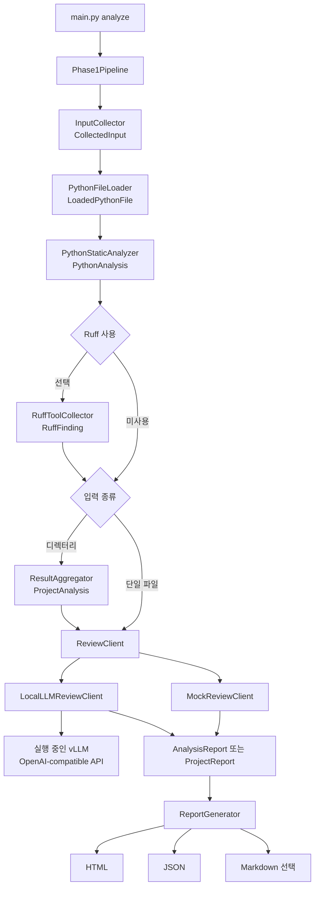

# Project NuriLab 아키텍처

이 문서는 현재 `main` 구현을 기준으로 Project NuriLab의 실행 흐름, 데이터 계약,
모듈 책임과 실패 경계를 설명합니다. 지원 범위와 빠른 실행은
[`../README.md`](../README.md), CLI 및 Local LLM 설정은 [`USAGE.md`](USAGE.md)를
참조하세요. 여기서 말하는 미래 연동은 구현 상태가 아니며 현재 동작을 설명하는
문단과 구분합니다.

## 시스템 경계

Project NuriLab은 입력 코드를 실행하지 않는 단일 프로세스 Python 정적 분석
애플리케이션입니다.

애플리케이션 안에서 수행하는 작업:

- Python 파일 또는 디렉터리의 입력 수집과 UTF-8 source 로딩
- AST 구조, 위험 호출 rule, secret pattern 분석
- 선택적 Ruff subprocess 결과 수집
- deterministic Mock review 또는 외부 Local LLM API 호출
- 프로젝트 결과 집계
- HTML, JSON, 선택적 Markdown report 생성

애플리케이션 경계 밖의 작업:

- vLLM server의 시작·종료, 모델 다운로드, GPU 관리
- 입력 코드나 실제 악성 샘플 실행
- 파인튜닝, model artifact, dataset, checkpoint 관리
- 외부 프로젝트 clone과 dependency 설치

## 전체 데이터 흐름



`Phase1Pipeline`이 현재 전체 흐름을 조정합니다. 이름은 초기 구현의 흔적이지만
단일 파일과 프로젝트 입력 모두를 처리합니다. CLI는 option을 해석하고 review
backend와 Ruff 사용 여부를 선택한 뒤 pipeline에 전달합니다.

## 실행 경로

### 입력 수집과 로딩

`InputCollector`는 입력 경로를 절대 경로로 정규화합니다.

- `.py` 파일은 단일 분석 대상으로 수집합니다.
- 디렉터리는 하위 `.py` 파일을 정렬된 순서로 재귀 수집합니다.
- `.git`, `.venv`, `__pycache__`, `.pytest_cache`, `.ruff_cache`, `build`, `dist`,
  `reports`는 제외합니다.
- 존재하지 않는 경로는 즉시 `FileNotFoundError`를 발생시킵니다.

`PythonFileLoader`는 각 수집 파일을 UTF-8로 읽어 `LoadedPythonFile`을 만듭니다.
decode, 권한, 파일 읽기 오류는 전체 pipeline을 중단하지 않고 `skipped=True`와
`skip_reason`이 있는 파일 결과로 변환합니다.

### deterministic 분석

`PythonStaticAnalyzer`는 `LoadedPythonFile`을 `PythonAnalysis`로 변환합니다.

1. 줄 수와 skip 상태를 기록합니다.
2. line-oriented secret pattern을 검사합니다.
3. `ast.parse()`로 Python AST를 생성합니다.
4. import, function, class와 위험 호출 rule을 수집합니다.

문법 오류는 `syntax_error` signal로 보존하며 다른 파일 분석을 중단하지 않습니다.
위험 호출은 직접 import alias와 `from ... import ...` binding을 canonical 호출
경로로 정규화해 rule을 조회합니다. 일부 위험 호출의 인자·실행 문맥을 확인하지만
전체 data flow를 분석하거나 악성 의도를 확정하지 않습니다.

### Ruff 보조 신호

`RuffToolCollector`는 `uv run ruff check <target> --output-format json`을 subprocess로
실행합니다. Ruff finding이 있을 때의 non-zero exit code는 pipeline 실패가 아닙니다.

- return code가 0이고 stdout이 비어 있거나 JSON `[]`이면 0 findings입니다.
- 유효한 Ruff JSON은 return code와 관계없이 `RuffFinding`으로 정규화합니다.
- non-zero return code와 빈 stdout 또는 subprocess `OSError`는 medium
  `RUFF_COMMAND_FAILED` diagnostic으로 보존합니다.
- stdout이 JSON이 아니면 `RUFF_PARSE_ERROR` finding을 만듭니다.

따라서 Ruff 실행 문제는 정적 분석 결과와 분리해 확인할 수 있는 보조 signal이며,
`--no-ruff`로 비활성화할 수 있습니다.

### 단일 파일과 프로젝트 집계

단일 파일 경로:

```text
PythonAnalysis + RuffFinding[] -> ReviewClient -> AnalysisReport
```

프로젝트 경로:

```text
PythonAnalysis[] + RuffFinding[] + CollectedInput
-> ResultAggregator -> ProjectAnalysis -> ReviewClient -> ProjectReport
```

`ResultAggregator`는 analyzed/skipped 파일 수, severity count, 파일별 요약과
프로젝트 risk level을 계산합니다. `analysis.summary.risk_level`은 deterministic
signal의 최고 severity를 요약한 값입니다.

## review 경계

`ReviewClient` protocol은 `PythonAnalysis | ProjectAnalysis`를 받아
`ReviewResult`를 반환합니다.

`MockReviewClient`는 네트워크 없이 정적 signal을 deterministic review finding으로
변환합니다. 기본 backend이며 테스트와 회귀 검증의 기준입니다.

`LocalLLMReviewClient`는 정규화한 정적 분석 payload만 실행 중인 vLLM
OpenAI-compatible `/chat/completions` endpoint에 전송합니다.

- 원본 source text는 Local LLM payload에 포함하지 않습니다.
- payload에는 byte budget과 truncation metadata가 적용될 수 있습니다. signal을
  중간에서 자르지 않고 포함·누락 수를 기록합니다.
- 응답은 strict JSON schema의 `summary`, `risk_level`, `findings`를 충족해야 합니다.
  review risk와 finding severity는 `low`, `medium`, `high`만 허용합니다.
- `reasoning_effort="low"`를 사용하고 provider-specific `include_reasoning`은 보내지
  않습니다. 응답의 별도 reasoning 필드는 사용하지 않습니다. JSON/schema 파싱 오류
  설명에는 content의 최대 200자 preview가 포함되어 report finding에 남을 수 있습니다.
- 상대 finding path는 분석 대상 기준의 절대 경로로 복원합니다.

`review.risk_level`은 선택한 review backend의 결과입니다. Local LLM이 실패해
`unknown`이어도 deterministic analysis와 `analysis.summary.risk_level`은 같은
report에 보존됩니다. Local LLM은 정적 분석 결과를 덮어쓰지 않습니다.

## 주요 데이터 계약

| 단계 | 데이터 모델 | 책임 |
| --- | --- | --- |
| 입력 수집 | `CollectedInput` | root, Python files, 제외 경로 |
| 파일 로딩 | `LoadedPythonFile` | source, lines, 읽기 skip 상태 |
| 파일 분석 | `PythonAnalysis` | AST, 위험 호출, secret, syntax, Ruff signal |
| 프로젝트 집계 | `ProjectAnalysis` | 파일 결과, Ruff 결과, project summary |
| review | `ReviewResult` | summary, review risk, review findings |
| 단일 report | `AnalysisReport` | metadata, `PythonAnalysis`, review |
| 프로젝트 report | `ProjectReport` | metadata, `ProjectAnalysis`, review |

`PythonAnalysis`에는 `path`, `line_count`, `language`, skip·syntax 상태,
imports/functions/classes, suspicious calls, secrets, Ruff findings가 들어갑니다.
`ProjectSummary`에는 `total_files`, `analyzed_files`, `skipped_files`,
`severity_counts`, `risk_level`, `file_summaries`가 들어갑니다.

일반 `ReviewFinding`은 `info`, `low`, `medium`, `high`, `critical`, `unknown`을
표현하며 허용되지 않은 severity는 `unknown`으로 정규화합니다. finding 필드는
`title`, `severity`, `file`, `line`, `column`, `source`, `rule_id`, `reason`,
`recommendation`입니다. 반면 Local LLM strict JSON 응답에 범위 밖 severity가 하나라도
있으면 개별 finding을 정규화하지 않고 응답 전체를 schema validation failure로
처리합니다.

## 실패 경계

| 실패 | 현재 처리 |
| --- | --- |
| 입력 경로 없음 또는 잘못된 경로 종류 | 예외 발생, report 생성 안 함 |
| UTF-8 decode, 권한, 파일 읽기 오류 | skipped file result로 보존 |
| Python syntax error | `syntax_error` signal로 보존 |
| Ruff invalid JSON | `RUFF_PARSE_ERROR` finding으로 보존 |
| Ruff non-zero + empty stdout 또는 subprocess `OSError` | medium `RUFF_COMMAND_FAILED` finding으로 보존하고 계속 |
| Local LLM 연결·timeout·HTTP 오류 | Local LLM failure finding으로 보존 |
| Local LLM JSON decode 또는 schema validation 오류 | Local LLM parsing finding으로 보존 |
| 출력 디렉터리 또는 파일 쓰기 실패 | 예외 발생 |

pipeline이 failure finding으로 바꾸는 장애와 호출자에게 예외를 반환하는 장애를
구분해야 합니다. report가 생성됐다는 사실은 모든 analyzer와 optional backend가
성공했다는 뜻이 아닙니다.

## 보고서 경계

`ReportGenerator`는 하나의 `AnalysisReport` 또는 `ProjectReport` payload를 여러
view로 직렬화합니다.

- JSON: canonical machine-readable artifact
- HTML: 기본 human-readable view
- Markdown: 선택 view

각 view는 다시 분석하지 않으며 같은 payload를 표현합니다. report의 정적 signal과
review finding을 함께 확인해야 하며, review text만으로 입력의 악성 여부를 확정하지
않습니다.

## 현재 모듈 책임

```text
project_nurilab/
├── input/          # 입력 수집과 UTF-8 로딩
├── analyzers/      # AST, rule, secret, Ruff signal
├── aggregation/    # project summary와 risk 집계
├── llm/            # Mock/Local review backend
├── reports/        # JSON/HTML/Markdown view 생성
├── schemas.py      # 단계 간 데이터 계약
├── pipeline.py     # 전체 orchestration
├── cli.py          # 사용자 입력과 dependency 선택
└── config.py       # 기본값과 제외 경로
```

새 모듈은 이 책임 경계에 들어갈 수 없는 경우에만 추가합니다.

## 계획 중인 MCP 연동

다음은 현재 구현이 아니라 향후 Linear 작업입니다. MCP 연동은
[`jadx-ai-mcp`](https://github.com/zinja-coder/jadx-ai-mcp)를 대상으로 하나의
제한된 외부 도구 계약을 정의하는 계획입니다.

```text
THE-151: 입력·출력·실패·provenance tool contract 확정
-> THE-154: contract를 따르는 연결 구현
-> THE-155: connector 결과와 상태를 report에 표시
```

도구의 허용 입력, 결과 provenance, timeout·오류 처리 및 report schema는
`THE-151`에서 확정되기 전까지 현재 데이터 계약이 아닙니다. 구현·테스트가 병합된
뒤에만 이 문서의 현재 흐름과 데이터 모델에 반영합니다.

별도 AegisLM endpoint 연결은 `THE-80`의 외부 LLM 백로그입니다. 기존
OpenAI-compatible review 경계를 사용할 수 있는지 검토하는 항목이며 MCP 연동의
선행 조건은 아닙니다.
